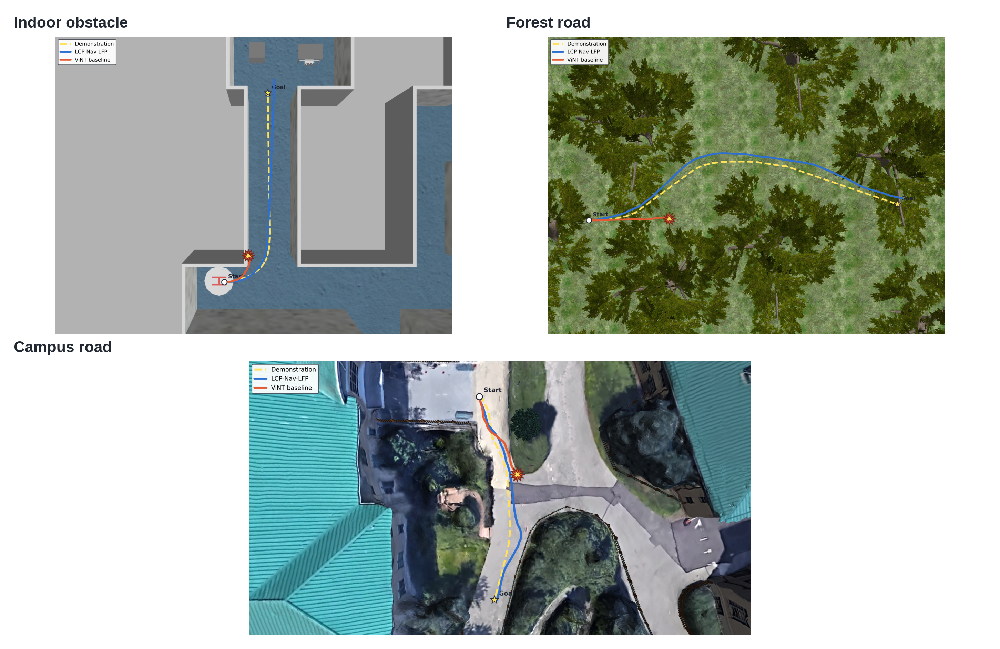

# LCP-Nav

## Latent Consequence Prediction for Cross-Domain Goal-Conditioned Visual Navigation

LCP-Nav is a lightweight visual-navigation policy for mobile robots operating across indoor obstacles, vegetation-rich roads and campus-like environments. The central idea is simple: route progress alone does not guarantee arrival. Before committing to an action sequence, the policy predicts where each candidate may end in a learned latent space and selects the candidate whose predicted endpoint best matches the visual goal.


### Why LCP-Nav?

Direct goal-conditioned policies can make local progress while accumulating terminal error. LCP-Nav introduces an endpoint-aware decision stage without generating future RGB images at deployment time:

1. **Propose** a small set of finite candidate trajectories.
2. **Imagine** their action-conditioned latent endpoints with shared latent dynamics.
3. **Select** the candidate that is most consistent with the goal.

The training pipeline combines trajectory supervision, latent transition prediction, candidate scoring and SIGReg-based non-collapse regularization. The deployed policy uses only recent RGB observations and a goal image.



### Repository contents

```text
.
├── assets/       # Compact figures for the project page
├── paper/        # Five-page English and Chinese manuscripts and figures
└── src/          # Core DVN/LCP-Nav training code and configurations
```

Large datasets, ROS bags, checkpoints, W&B logs and intermediate experiment archives are intentionally excluded. They are not required to understand the method and should be stored separately from the source repository.

### Paper

- [English five-page manuscript](paper/LCP-Nav_IEEE_5page.pdf)
- [Chinese version](paper/LCP-Nav_IEEE_5page_中文版.pdf)
- [English LaTeX source](paper/main.tex)
- [Chinese LaTeX source](paper/main_zh.tex)
- [Extended results gallery and compact result tables](results/README.md)

The paper reports matched cross-domain tests, latent-diagnostic interventions and repeated Gazebo closed-loop evaluations. The claims are limited to the evaluated datasets, checkpoint rules and fixed simulation routes.

The GitHub release also preserves additional figures that were prepared during the study but could not fit into the five-page manuscript. They are organized by evidence role rather than presented as an undifferentiated image dump.

### Code overview

The main implementation is under `src/vint_train/`:

- `models/dvn/dvn.py`: candidate trajectory prediction and latent consequence modeling
- `models/regularizers.py`: SIGReg regularization
- `training/train_eval_loop.py`: training and evaluation loop
- `training/train_utils.py`: losses, logging and evaluation utilities
- `config/`: training configurations used in the study

The source environment is described in [`src/train_environment.yml`](src/train_environment.yml). The configurations use repository-relative placeholder paths; update `datasets.*` paths before running training.

### Reproduction boundary

This repository is a compact research release rather than a dataset mirror. To reproduce the reported numbers, obtain the corresponding datasets and checkpoints separately, update the configuration paths, and run the matched evaluation protocol described in the paper.

### Attribution

Parts of the training stack are adapted from the General Navigation Models / ViNT codebase. Please retain the upstream attribution and license when redistributing this repository. See [`LICENSE`](LICENSE).
