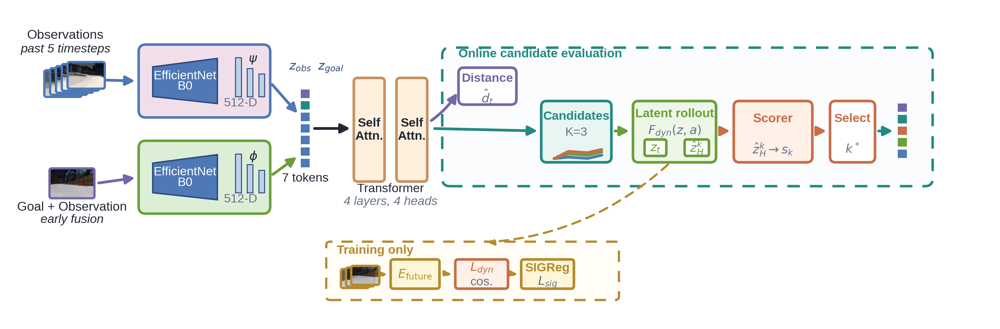

# LCP-Nav

## Latent Consequence Prediction for Cross-Domain Goal-Conditioned Visual Navigation

LCP-Nav is a goal-conditioned visual-navigation policy for mobile robots. Given a short history of RGB observations and a goal image, the policy proposes several short-horizon trajectories, predicts the latent state that each trajectory would reach, and selects the candidate whose predicted consequence is most compatible with the goal.

The project is motivated by a practical failure mode of visual navigation: a robot can make apparently reasonable local progress while gradually drifting away from the route that actually reaches the goal. LCP-Nav therefore evaluates not only **what action looks good now**, but also **where that action is likely to lead**.



> **Project status.** This repository is a compact research release. It contains the core model and training code, the five-page manuscript package, selected experiment configurations, derived result tables and a complete figure gallery. Raw datasets, ROS bags, checkpoints and private experiment logs are intentionally kept outside the repository.

## At a glance

| Item | Description |
|---|---|
| Task | Goal-conditioned visual navigation from RGB observations |
| Input | Five-frame temporal context plus a goal image in the released protocol |
| Output | Multiple short-horizon waypoint/action hypotheses and one selected candidate |
| Main model | DVN/LCP-Nav with latent dynamics and candidate-conditioned scoring |
| Vision encoder | EfficientNet-B0 in the released DVN configuration |
| Candidate prediction | `K=5` hypotheses, each with `T=5` action steps by default |
| Latent regularization | SIGReg to reduce representation collapse during training |
| Evaluation evidence | Offline held-out comparisons, ablations, cross-dataset tests and repeated Gazebo simulation summaries |
| Reproducibility boundary | Dataset paths and model checkpoints must be supplied locally |

## The problem and the idea

The method follows a simple story:

1. A direct goal-conditioned policy predicts a local trajectory from the current observation and goal.
2. Several trajectories may look plausible in the current view, although they do not have the same long-term consequence.
3. LCP-Nav rolls each candidate forward in a learned latent dynamics model.
4. A candidate-conditioned scorer compares the current latent state, goal latent, imagined endpoint and candidate trajectory.
5. The highest-scoring candidate is selected for execution.

The deployment-time decision can be summarized as:

```text
recent RGB observations + goal image
                 │
                 ▼
      visual/temporal state encoding
                 │
                 ▼
     K candidate short-horizon actions
                 │
                 ▼
     latent rollout for every candidate
                 │
                 ▼
       candidate-conditioned scoring
                 │
                 ▼
           selected trajectory
```

The model does not synthesize future RGB frames at deployment time. It predicts future consequences in the learned latent space, which keeps the decision stage compact and avoids the cost and instability of pixel-level future prediction.

## What is special about LCP-Nav?

The released DVN implementation combines four components:

### 1. Temporal visual state encoding

`DVN` encodes the recent observation history and the current observation with an EfficientNet-B0 visual encoder. The current observation and the goal image are fused and passed through the goal encoder. A transformer then processes history, observation and goal tokens with type embeddings. It produces:

- `z_obs`: the current observation state in latent space;
- `z_goal`: the goal representation in the same latent space;
- a distance estimate between the current state and the goal;
- multiple candidate action sequences.

### 2. Multi-hypothesis trajectory prediction

`MultiHypothesisHead` predicts `K` candidate trajectories instead of a single average action. In the default configuration, each candidate contains five steps and each step contains planar waypoint information plus a sine/cosine orientation representation. This allows the policy to retain several plausible local options before selection.

### 3. Latent consequence prediction

`RobustDynamics` embeds each candidate action and repeatedly updates the current latent state. After `T` steps, the resulting `z_end` is an imagined endpoint for that candidate. The endpoint is not an image; it is a compact learned representation of the predicted future state.

### 4. Candidate-conditioned scoring and SIGReg

`CandidateConditionedScorer` receives the observation latent, goal latent, imagined endpoint, endpoint-to-goal difference and an embedding of the candidate trajectory. It outputs one score per candidate; the highest score is used for selection.

During training, `SIGReg` regularizes the latent embeddings so that the representation does not collapse into a low-information solution. The training loop combines distance prediction, multi-hypothesis action/scoring loss, latent future-prediction loss and SIGReg according to the selected YAML configuration.

## Repository map

```text
LCP-Nav-public/
├── README.md
├── LICENSE
├── THIRD_PARTY_NOTICES.md
├── assets/
│   ├── architecture.png             # project-level architecture illustration
│   └── overhead_scene.png            # simulation/campus-like scene context
├── paper/
│   ├── main.tex                      # English five-page manuscript source
│   ├── main_zh.tex                   # Chinese manuscript source
│   ├── IEEEtran.cls                  # LaTeX class used by the manuscript
│   ├── LCP-Nav_IEEE_5page.pdf        # final English manuscript
│   ├── LCP-Nav_IEEE_5page_中文版.pdf   # final Chinese manuscript
│   ├── figures/                      # vector figures used in the paper
│   └── README.md                     # manuscript compilation instructions
├── results/
│   ├── README.md                     # evidence map and recommended reading order
│   ├── figures/                      # extended figure gallery, PNG and PDF
│   └── data/                         # compact derived CSV summaries
└── src/
    ├── train.py                     # main training/evaluation entry point
    ├── setup.py                      # install the local vint_train package
    ├── train_environment.yml         # reference Conda environment
    ├── config/
    │   ├── defaults.yaml             # shared fallback parameters
    │   └── *.yaml                    # public LCP-Nav and baseline protocols
    └── vint_train/
        ├── data/                     # ViNT-format dataset loading and preprocessing
        ├── models/
        │   ├── dvn/                  # LCP-Nav/DVN model and latent dynamics
        │   ├── vint/                 # ViNT baseline components
        │   ├── gnm/                  # GNM baseline components
        │   ├── nomad/                # NoMaD-related components retained from the stack
        │   ├── dinov2/               # DINOv2 RGB-D policy components
        │   └── lsnet/                # additional model components retained for comparison
        ├── training/                 # losses, loops, logging and checkpoint handling
        ├── process_data/             # bag/data preprocessing helpers
        └── visualizing/              # trajectory plotting and visualization utilities
```

## Module-by-module guide

### `src/train.py`: the single entry point

This script is responsible for the complete experiment lifecycle:

1. Read `config/defaults.yaml` and the selected experiment YAML.
2. Construct the ViNT-format training and test datasets.
3. Instantiate the requested model from `model_type`.
4. Create the optimizer and optional learning-rate scheduler.
5. Train and/or evaluate using the model-specific loop.
6. Save checkpoints under `logs/<project_name>/<run_name>/`.

Supported model types wired into the entry point include `gnm`, `vint`, `dvn`, `dinov2` and `nomad`. The public LCP-Nav experiments use `model_type: dvn`.

Useful command-line overrides are:

```text
--config       YAML configuration path
--run-name     replace the base run name
--seed         replace the YAML random seed
--gpu-ids      choose one or more GPU IDs
--use-world-model  enable/disable imagined latent endpoint prediction
```

### `src/config/`: experiment protocols

The YAML files are intended to make the experiments readable and adjustable without editing model code. The most important public configurations are:

| Configuration | Purpose |
|---|---|
| `dvn_sigreg_go_stanford_15.yaml` | Main LCP-Nav/DVN training protocol with SIGReg |
| `dvn_sigreg_go_stanford_eval_smoke.yaml` | Lightweight data/model pipeline smoke-test configuration |
| `dvn_k1_*`, `dvn_k3_*` | Candidate-number and checkpoint-role comparisons |
| `dvn_sigreg_w003_*`, `dvn_sigreg_w006_*`, `dvn_k3_sigreg_w015_*` | SIGReg-weight sensitivity checks |
| `dvn_k3_actionbest_cross_eval.yaml` | Cross-dataset evaluation using the action-oriented checkpoint role |
| `dvn_k3_lfpbest_cross_eval.yaml` | Cross-dataset evaluation using the latent-future-prediction checkpoint role |
| `vint_go_stanford_15.yaml` | Direct-policy ViNT baseline protocol |

The main configuration exposes the key method parameters:

| Field | Meaning |
|---|---|
| `context_size` | Number of previous frames in the temporal context; default is `5` |
| `len_traj_pred` | Number of predicted short-horizon steps; default is `5` |
| `num_hypotheses` | Number of candidate trajectories; default is `5` |
| `obs_encoder` | Visual encoder used by DVN; the released protocol uses `efficientnet-b0` |
| `obs_encoding_size` | Dimension of the visual/latent representation |
| `use_world_model` | Whether to roll candidates to imagined latent endpoints |
| `sigreg.weight` | Weight of the SIGReg regularizer; set to `0` for the no-SIGReg comparison |
| `sigreg.knots` / `sigreg.num_proj` | Numerical resolution of the SIGReg statistic |
| `depth_img` | Whether the dataset loader also looks for depth files; the core released DVN forward path is RGB-based |
| `datasets.*` | Dataset root and train/test split paths |
| `project_folder` | Generated automatically under `logs/` |

All dataset paths in the public YAML files are placeholders relative to `src/`. Replace them with paths on the local machine before running an experiment.

### `src/vint_train/models/dvn/`: the LCP-Nav implementation

| File | Role |
|---|---|
| `dvn.py` | Main `DVN` module, feature extraction, candidate prediction, latent rollout and output assembly |
| `heads.py` | `MultiHypothesisHead` and `CandidateConditionedScorer` |
| `dynamics.py` | `RobustDynamics`, the action-conditioned latent transition model |
| `transformer_module.py` | Transformer over history/observation/goal tokens |
| `nav_module.py` | Token pooling used to summarize transformer features |
| `mhp_loss.py` | Multi-hypothesis trajectory/scoring loss |
| `safety_loss.py`, `safety_utils.py` | Safety-related utilities retained from the research stack |
| `densenet.py` | Dense network utility used by related model components |
| `test.py` | Local model-level test helper |

The core `DVN.forward()` output is a dictionary containing:

```python
{
    "dist_pred":    ...,  # predicted normalized distance
    "action_pred":  ...,  # [B, K, T, A] candidate trajectories
    "action_scores": ..., # [B, K] candidate scores
    "loss_dyn":     ...,  # latent dynamics supervision loss
    "sigreg_loss":  ...,  # SIGReg value
}
```

With `learn_angle: true`, `A=4`: two planar waypoint coordinates and a two-dimensional sine/cosine orientation representation. With `learn_angle: false`, `A=2`.

### `src/vint_train/models/regularizers.py`: representation regularization

`SIGReg` estimates a sketched isotropic-Gaussian regularization statistic over latent embeddings. It is applied during training and contributes through `sigreg.weight`. It is not required by the deployment-time candidate-selection computation.

### `src/vint_train/training/`: training and evaluation mechanics

- `train_eval_loop.py` selects the model-specific train/evaluation loop and writes checkpoints.
- `train_utils.py` contains DVN/ViNT/NoMaD/DINOv2 losses, metric logging, visualization hooks and checkpoint-related utilities.
- `logger.py` provides moving-average logging used during training.

For DVN, the training loop monitors distance loss, multi-hypothesis loss, latent future-prediction loss, SIGReg loss, total loss and waypoint/orientation similarity. The latent future-prediction term is warmed up over the early epochs in the current implementation.

### `src/vint_train/data/`: data interface

`vint_dataset.py` implements the dataset interface used by the training entry point. It:

- reads trajectory metadata;
- samples a current observation and a future or negative goal;
- builds temporal context frames;
- converts future poses into the robot-local coordinate frame;
- generates waypoint/action labels and validity masks;
- loads short future RGB frames used as latent-dynamics supervision;
- creates an LMDB image cache and index files when they are absent.

The loader expects the established ViNT/GNM-style trajectory layout. A minimal schematic layout is:

```text
data/
├── datasets/
│   └── go_stanford_96/
│       └── <trajectory_name>/
│           ├── traj_data.pkl
│           ├── 0.jpg
│           ├── 1.jpg
│           └── ...
└── splits/
    └── go_stanford/
        ├── train/
        │   └── traj_names.txt
        └── test/
            └── traj_names.txt
```

When `depth_img: true`, the loader additionally checks for a sibling directory such as `go_stanford_96_depth/<trajectory_name>/<t>.npy`. Missing depth files are replaced with zeros by the loader. The trajectory pickle must contain the position and yaw arrays required by `_compute_actions()`.

### `src/vint_train/process_data/`: preprocessing helpers

This module contains utilities and a configuration template for converting raw bag/trajectory data into the image-and-trajectory structure expected by `ViNT_Dataset`. The public release does not include raw ROS bags or a complete dataset conversion command because those steps depend on the robot, camera calibration and local storage layout.

### `src/vint_train/visualizing/`: diagnostics and plots

The visualization utilities convert predicted waypoints and action sequences into trajectory plots, point overlays and distance summaries. They support debugging during training; the curated publication figures in `results/figures/` are the stable artifacts to use when presenting the project.

### `results/`: the evidence layer

`results/README.md` is an index of the extended evidence gallery. It maps each figure to its role in the argument:

- motivation: the arrival gap in direct visual navigation;
- method: imagined endpoint scoring;
- training: latent prediction and SIGReg;
- main result: held-out offline comparisons;
- mechanism: candidate/scorer and latent-collapse ablations;
- transfer: cross-dataset generalization;
- deployment: online candidate selection and repeated simulation;
- scenario: overhead views of indoor, forest and campus-like environments.

The CSV files under `results/data/` are compact derived summaries for inspection and plotting. They are not raw sensor data and should not be interpreted as a replacement for the original evaluation protocol.

## Installation

The reference environment is based on Python 3.8 and CUDA 10. The environment file is preserved for historical reproducibility; modern CUDA/PyTorch installations may require adapting the versions to the local machine.

```bash
git clone https://github.com/suibian456y3/LCP-Nav.git
cd LCP-Nav/src

conda env create -f train_environment.yml
conda activate nomad_train
pip install -e .
```

If the Conda environment already exists, install the local package directly:

```bash
cd LCP-Nav/src
pip install -e .
```

The repository does not vendor datasets or checkpoints. Confirm that the required PyTorch/CUDA version, GPU driver and dataset dependencies are available before starting a long run.

## Running the main training protocol

Run commands from `src/`, because `train.py` resolves `config/defaults.yaml`, YAML paths and output directories relative to the current working directory:

```bash
cd LCP-Nav/src
python train.py \
  --config config/dvn_sigreg_go_stanford_15.yaml \
  --gpu-ids 0 \
  --run-name dvn_sigreg_local
```

Before running, edit the `datasets.go_stanford` paths in the YAML file so that they point to the local dataset and split folders. The main public configuration uses:

```yaml
model_type: dvn
context_size: 5
len_traj_pred: 5
num_hypotheses: 5
use_world_model: true
sigreg:
  weight: 0.09
```

The run creates a timestamped directory under `src/logs/`, including the latest checkpoint and per-epoch checkpoints. Training with `use_wandb: false` does not require a Weights & Biases account.

## Smoke testing the pipeline

The smoke configuration is useful for checking imports, dataset paths, batch construction and the DVN evaluation loop before committing to a full run:

```bash
cd LCP-Nav/src
python train.py \
  --config config/dvn_sigreg_go_stanford_eval_smoke.yaml \
  --gpu-ids 0
```

This still requires the referenced dataset and split files. It is a pipeline check, not a substitute for the reported experiment and should not be used to claim the paper's final metrics.

## Evaluating a trained run

The training script restores a run through the `load_run` field. A typical local evaluation configuration adds a run identifier that points to an existing directory under `src/logs/`:

```yaml
train: false
load_run: your_project/your_run_name
```

Then run:

```bash
cd LCP-Nav/src
python train.py \
  --config config/dvn_sigreg_go_stanford_eval_smoke.yaml \
  --gpu-ids 0
```

For a checkpoint from a different directory, either place it under the expected `logs/<load_run>/latest.pth` location or adapt the loading logic in `train.py`/`train_eval_loop.py`. The public release does not include the study checkpoints.

## Using the DVN module directly

The model can also be instantiated independently for inspection or integration into another evaluation loop:

```python
import torch
from vint_train.models.dvn.dvn import DVN

model = DVN(
    context_size=5,
    len_traj_pred=5,
    learn_angle=True,
    vision_encoder="efficientnet-b0",
    encoding_size=512,
    num_hypotheses=5,
    use_world_model=True,
)

B = 2
obs = torch.randn(B, 6, 3, 96, 96)   # 5 history frames + current frame
goal = torch.randn(B, 3, 96, 96)
next_img = torch.randn(B, 3, 3, 96, 96)  # optional future RGB supervision
next_mask = torch.ones(B, 3)

outputs = model(
    obs_img=obs,
    goal_img=goal,
    next_img=next_img,
    next_mask=next_mask,
)

candidate_id = outputs["action_scores"].argmax(dim=1)
selected = outputs["action_pred"][
    torch.arange(B), candidate_id
]
```

For real inference, replace the random tensors with the same preprocessing used by `ViNT_Dataset`, load a trained checkpoint, call `model.eval()`, and execute the selected short-horizon action through the robot or simulator interface. This repository does not include a complete ROS controller or simulator launch file; the simulation results in the gallery are retained as publication evidence and scenario context.

## Reproducing the paper package

The manuscript and figures are available without any additional data download:

- [English five-page manuscript](paper/LCP-Nav_IEEE_5page.pdf)
- [Chinese manuscript](paper/LCP-Nav_IEEE_5page_中文版.pdf)
- [English LaTeX source](paper/main.tex)
- [Chinese LaTeX source](paper/main_zh.tex)
- [Manuscript package instructions](paper/README.md)
- [Extended results gallery](results/README.md)

Compile the English and Chinese sources as follows:

```bash
cd LCP-Nav/paper
pdflatex main.tex
pdflatex main.tex

xelatex main_zh.tex
xelatex main_zh.tex
```

The figures in `paper/figures/` are the vector figures used in the five-page paper. The more extensive project figures are under `results/figures/`, where PNG previews are convenient for browser viewing and PDF files are available for vector-quality download.

## Weights & Biases logging

The public configurations set `use_wandb: false` by default. To enable logging, authenticate with your own account and set the option in a local, uncommitted YAML override:

```bash
wandb login
```

```yaml
use_wandb: true
wandb_entity: your_wandb_entity   # optional
```

Never put an API key directly into source code or a committed YAML file. Use the W&B CLI, an environment variable or another local credential mechanism instead.

## Limitations and reproducibility notes

- The public repository does not contain the original datasets, ROS bags, checkpoints or private logs.
- Dataset preparation is environment-specific and depends on camera calibration, trajectory metadata and storage layout.
- The provided YAML files document the study protocols, but exact final numbers require the matching datasets, checkpoint-selection rules and evaluation splits.
- The closed-loop results are summarized as derived figures/CSVs; a complete Gazebo/ROS deployment stack is not part of this compact release.
- The codebase retains baseline and research-stack modules for comparison. The primary contribution is the DVN/LCP-Nav path under `src/vint_train/models/dvn/`.

## Attribution

Parts of the training stack are adapted from the General Navigation Models / ViNT ecosystem. Please preserve the upstream attribution and license requirements when reusing or redistributing the code. See [`THIRD_PARTY_NOTICES.md`](THIRD_PARTY_NOTICES.md) and [`LICENSE`](LICENSE).

## Citation

The manuscript package is included in [`paper/`](paper/). If you use the method, figures or code, please cite the associated LCP-Nav paper once the bibliographic information is finalized.
